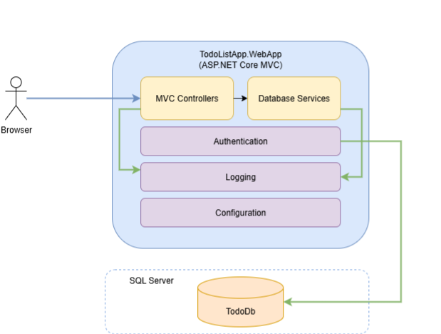

# To-do List Application

## Software Architecture

You can choose between two architectural approaches based on your skill level and learning objectives:

### Option 1: Monolithic MVC Architecture (Recommended for Regular Students)

The solution uses a **monolithic architecture** with a single ASP.NET Core MVC application:
  * The **presentation and logic tier** — the web application named *TodoListApp.WebApp* that provides [browser user interface](https://en.wikipedia.org/wiki/Browser_user_interface) and handles all business logic for managing to-do lists.
  * The **data tier** — the relational database management system for storing to-do lists and user data.

This approach simplifies development by keeping all functionality in one application, making it easier to understand data flow and debug issues.

### Option 2: 3-Tier Architecture with Separate Web API (Advanced Students Only)

The solution uses a [3-tier architecture](https://en.wikipedia.org/wiki/Multitier_architecture):
  * The **presentation tier** — the web application named *TodoListApp.WebApp* that provides [browser user interface](https://en.wikipedia.org/wiki/Browser_user_interface) for the end-users allowing them to manage their to-do lists.
  * The **logic (application) tier** — the web API application named *TodoListApp.WebApi* that provides a RESTful API the web application must use to retrieve or save to-do lists or user's data.
  * The **data tier** — the relational database management system for storing to-do lists and other user's data.

This approach teaches distributed application design and API development but requires more complex setup and debugging.

## Database Configuration

The choice of database management system for the data tier depends on the platform on which the development and deployment of the application will be carried out.
  * If you are a Windows user, consider using [SQL Server Express LocalDB](https://learn.microsoft.com/en-us/sql/database-engine/configure-windows/sql-server-express-localdb?view=sql-server-ver16). You can enable this feature through the [Visual Studio Installer](https://visualstudio.microsoft.com/downloads) (see the details on the page). You may also use [SQL Server Express 2022](https://learn.microsoft.com/en-us/sql/sql-server/editions-and-components-of-sql-server-2022).
  * If you are a Mac or Linux user, consider using [PostgreSQL](https://www.postgresql.org/) or [SQLite](https://sqlite.org/).

### Database Structure

**For Monolithic Architecture (Option 1):**
The application stores its data in a single relational database that contains both Identity data and application data.

**For 3-Tier Architecture (Option 2):**
The application must store its data in two relational databases.
  * The *UsersDb* database must be used to store Identity configuration data (user names, passwords, and profile data).
  * The *TodoListDb* database must be used to store the user data (to-do lists, tasks, tags and comments).
